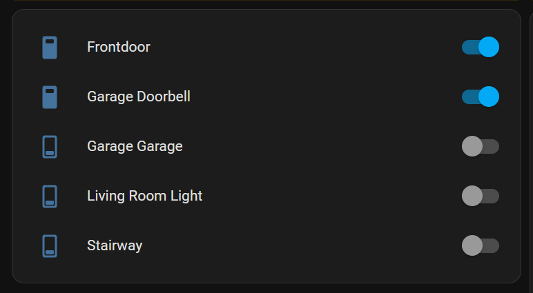
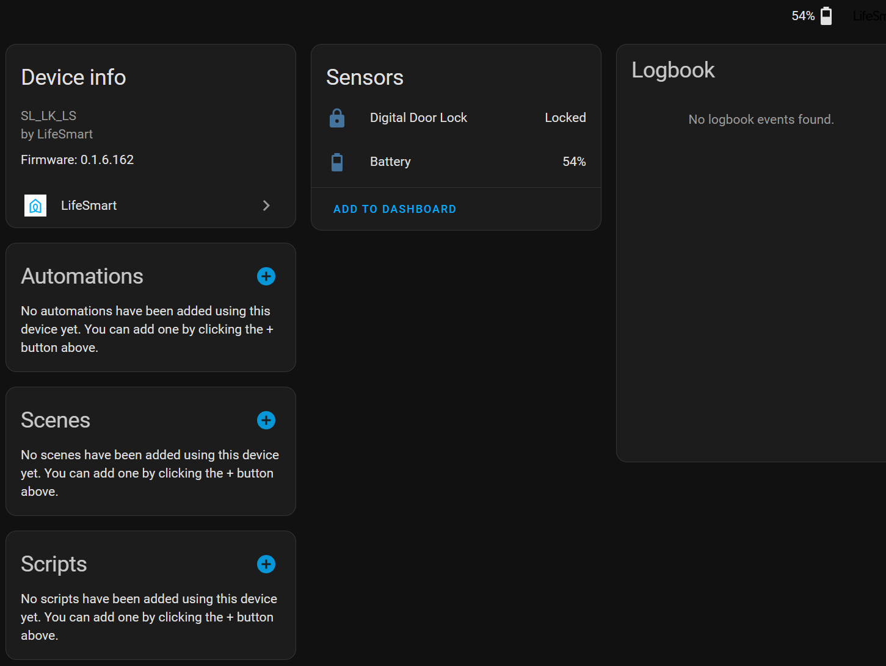
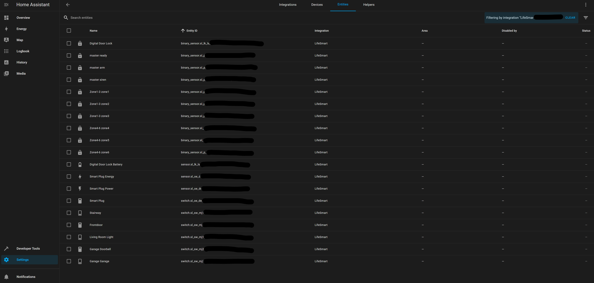
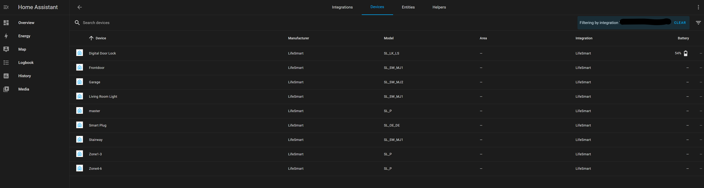

 
 [](https://app.fossa.com/projects/git%2Bgithub.com%2FiKaew%2Fhass-lifesmart-addon?ref=badge_shield)
---


Instructions
==== 
Lifesmart devices for Home Assistant

Prerequisites: 
---
1. Find current LifeSmart region for your country (America, Europe, Asia Pacific, China (old, new , VIP)). [See regional server list here](./docs/api-regions.md)


1. New Application from LifeSmart Open Platform to obtain `app key` and `app token`, http://www.ilifesmart.com/open/login (caution! this url is not https and all content is in chinese, browse with translation should help)

1. Login to application created in previous bullet with LifeSmart user to grant 3rd party application access to get `user token`, please ensure you use the api address with correct region. 

**Please note that, by default application from LifeSmart Open Platform won't return you Lock devices type. You have to contact them to get it granted to your application.**

How it works:
---

- This add-on required internet access, first when add-on loaded it will call LifeSmart API to get all devices to setup on Home Assistant, After that it will get updated from LifeSmart via websocket. There is no direct communication between HA and local LifeSmart hub at the moment. 


How to install:
---

### HACS (Recommended)

1. Open Home Assistant.
1. Go to `HACS` -> `Integrations`.
1. Click `Explore & Download Repositories`.
1. Search for `LifeSmart`.
1. Select the LifeSmart integration and click `Download`.
1. Restart Home Assistant when HACS asks you to.
1. Go to `Settings` -> `Devices & Services`.
1. Click `Add Integration`, search for `LifeSmart`, and complete the setup.

Installing from HACS lets Home Assistant notify you when a new version is available.

### Manual

Use manual installation only if you cannot use HACS.

1. Copy the `custom_components/lifesmart` directory to `config/custom_components/` in Home Assistant.
1. Restart Home Assistant.
1. Go to `Settings` -> `Devices & Services`.
1. Click `Add Integration`, search for `LifeSmart`, and complete the setup.

   Configuration required for this add-on via UI (see example screen below)
   ```
   lifesmart:
     appkey: | your appkey|  
     apptoken: | your apptoken| 
     usertoken: | your usertoken|  
     userid: | your userid|
     userpassword: | your password that use to login mobile app |
     url: | your api address|  #e.g. api.apz.ilifesmart.com for asia pacific, api.us.ilifesmart.com for US  
    ```


### HACS with Custom repository (Recommended)
1. Go to HACS > Integration > 3 dots menu at the top right > choose Custom Repository

   
1. In custom repository dialog enter 

   Repository: `https://github.com/iKaew/hass-lifesmart-addon`

   Category: `Integration`

1. Click Add
1. Setup integration via add Integration

Via HACS should allow you to get new version when it ready. 

After the addon stable, I'll push the repo be in deault list of HACS and (long way) later to be included in Official Integration of HA.


How to find user id from the mobile app
---


Example
---








Supported devices:
---
Since there are a lot of refactored and code changes, some old device removed from supported list for now. 
1. Switch 

1. Intelligent door lock information feedback

1. Smart Plug

1. Motion sensor, dynamic sensor, door sensor, environmental sensor, formaldehyde/gas sensor

1. Curtain motor (DOOYA and other brands via LifeSmart controller)

1. Lighting: SPOT devices with RGB/RGBW control

1. IR Remote Control: SPOT devices with IR remote learning and control

1. A/C Remote Control: SPOT devices configured as climate entities through the options flow

1. A/C Control Panel: native LifeSmart central air board devices

1. Nature Series: switch panels, temperature sensor, and thermostat panel variants

1. ~~Universal remote control~~

List of supported devices

Switch: 
| Model  | Remark |
| ------ | ------ |
| OD_WE_OT1 | |
| SL_MC_ND1 | |
| SL_MC_ND2 | |
| SL_MC_ND3 | |
| SL_NATURE | |
| SL_OL | |
| SL_OL_3C | |
| SL_OL_DE | |
| SL_OL_UK | |
| SL_OL_UL | |
| SL_OL_W | |
| SL_P_SW | |
| SL_S | |
| SL_SF_IF1 | |
| SL_SF_IF2 | |
| SL_SF_IF3 | |
| SL_SF_RC | |
| SL_SPWM | |
| SL_SW_CP1 | |
| SL_SW_CP2 | |
| SL_SW_CP3 | |
| SL_SW_DM1 | |
| SL_SW_FE1 | |
| SL_SW_FE2 | |
| SL_SW_IF1 | |
| SL_SW_IF2 | |
| SL_SW_IF3 | |
| SL_SW_MJ1 | Tested with real devices |
| SL_SW_MJ2 | Tested with real devices |
| SL_SW_MJ3 | |
| SL_SW_ND1 | |
| SL_SW_ND2 | |
| SL_SW_ND3 | |
| SL_SW_NS3 | |
| SL_SW_RC | |
| SL_SW_RC1 | |
| SL_SW_RC2 | |
| SL_SW_RC3 | |
| SL_SW_NS1 | |
| SL_SW_NS2 | |
| SL_SW_NS3 | |
| V_IND_S | |

Door Locks: 
| Model  | Remark |
| ------ | ------ |
| SL_LK_LS | Tested with real devices |
| SL_LK_GTM | |
| SL_LK_AG | |
| SL_LK_SG | |
| SL_LK_YL | |

Generic Controller: 
| Model  | Remark |
| ------ | ------ |
| SL_P | Tested with real devices |


Smart Plug: 
| Model  | Remark |
| ------ | ------ |
| SL_OE_DE | Metering supported , Tested with real devices |
| SL_OE_3C | Metering supported |
| SL_OL_W | Metering supported |
| OD_WE_OT1 | |
| ~~SL_OL_UL~~ | |
| ~~SL_OL_UK~~ | |
| ~~SL_OL_THE~~ | |
| ~~SL_OL_3C~~ | |
| ~~SL_O~~L | |

Binary Sensors:
| Model  | Remark |
| ------ | ------ |
| SL_SC_MHW | Motion sensor |
| SL_SC_BM | CUBE motion sensor |
| SL_SC_CM | Motion sensor (AAA battery) |
| SL_SC_G | Guard / door sensor |
| SL_SC_BG | CUBE guard / door sensor |
| SL_P_A | Smoke sensor |
| SL_P | Generic controller binary inputs |

Nature Series:
| Model  | Remark |
| ------ | ------ |
| SL_NATURE | Nature Mini/MiniS and Nature Mini Pro switch panels |
| SL_NATURE | Nature thermostat panels with current/target temperature, HVAC mode, and fan speed |

Nature Series support is based on the attributes reported by the device. Switch-board variants create switch entities for `P1`, `P2`, and `P3`. Thermostat variants create a climate entity, and devices with a `P4` temperature attribute also expose a temperature sensor.

Curtain Motor / Cover: 
| Model  | Remark |
| ------ | ------ |
| SL_DOOYA | Supports position control (0-100%) |
| SL_DOOYA_V2 | Quick Link Curtain Motor with position control |
| SL_DOOYA_V3 | Tubular Motor with position control |
| SL_DOOYA_V4 | Tubular Motor (lithium battery) with position control |
| SL_SW_WIN | Curtain control switch (open/close/stop) |
| SL_CN_IF | BLEND curtain controller (open/close/stop) |
| SL_CN_FE | Gezhi/Sennathree-key curtain (open/close/stop) |
| SL_P_V2 | MINS curtain motor controller (open/close/stop) |

For detailed curtain device setup and usage, see [CURTAIN_SUPPORT.md](./CURTAIN_SUPPORT.md)

Lighting / SPOT Devices: 
| Model  | Remark |
| ------ | ------ |
| SL_SPOT | RGB/RGBW light control + IR remote control + optional A/C climate control |
| MSL_IRCTL | IR remote control + optional A/C climate control |
| OD_WE_IRCTL | IR remote control + optional A/C climate control |

For SPOT devices, two entities are created:
- **Light entity**: Controls RGB/RGBW lighting functions
- **Remote entity**: Handles IR remote control learning and sending

If a SPOT device is configured as an A/C remote, a third entity is also created:
- **Climate entity**: Controls supported A/C functions through LifeSmart IR profiles

## SPOT A/C Setup

SPOT A/C control is configured from the integration options flow.

1. Add and set up the LifeSmart integration normally
1. Open `Settings -> Devices & Services -> LifeSmart -> Configure`
1. Choose `Configure SPOT A/C remote`
1. Select the SPOT device
1. Optionally search for the brand name
1. Select the A/C brand
1. Select the remote profile returned by the LifeSmart API
1. Save

After saving, the integration reloads and creates a climate entity for that SPOT device.

Current SPOT A/C behavior:
- Uses LifeSmart cloud IR profiles for the selected A/C brand/profile
- Restores the last Home Assistant state after reload
- Does not expose current temperature, because SPOT devices do not have a built-in temperature sensor
- Supports removing configured A/C remotes from the same options flow

For more details, see [SPOT_SUPPORT.md](./SPOT_SUPPORT.md)

## Native A/C Control Panels

Native LifeSmart A/C control panels are discovered automatically as climate entities.

| Model  | Remark |
| ------ | ------ |
| V_AIR_P | Central air board |
| V_SZJSXR_P | Uses the V_AIR_P attribute specification |
| V_T8600_P | Uses the V_AIR_P attribute specification |

Supported controls:
- Power on/off
- HVAC mode: Auto, Fan, Cool, Heat, Dry
- Target temperature
- Current temperature
- Fan speed: Low, Medium, High

These devices use the LifeSmart `EpSet` API directly, rather than SPOT IR profiles.

This project is forked/combined from serveral projects below 
---
- https://github.com/skyzhishui/custom_components by @skyzhishui
- https://github.com/Blankdlh/hass-lifesmart by @Blankdlh
- https://github.com/likso/hass-lifesmart by @likso


## License
[](https://app.fossa.com/projects/git%2Bgithub.com%2FiKaew%2Fhass-lifesmart-addon?ref=badge_large)
