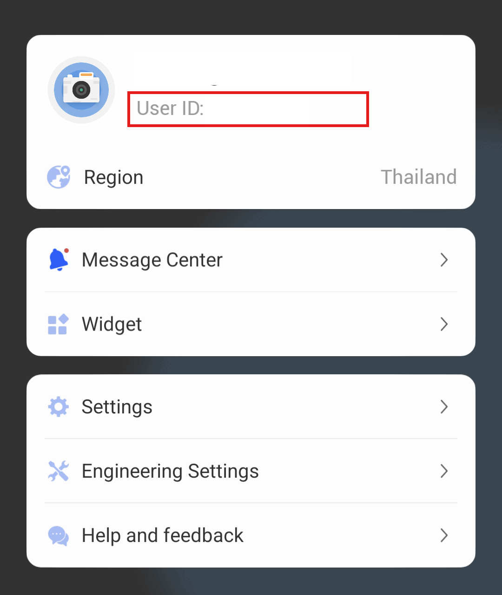
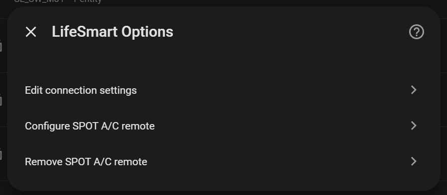
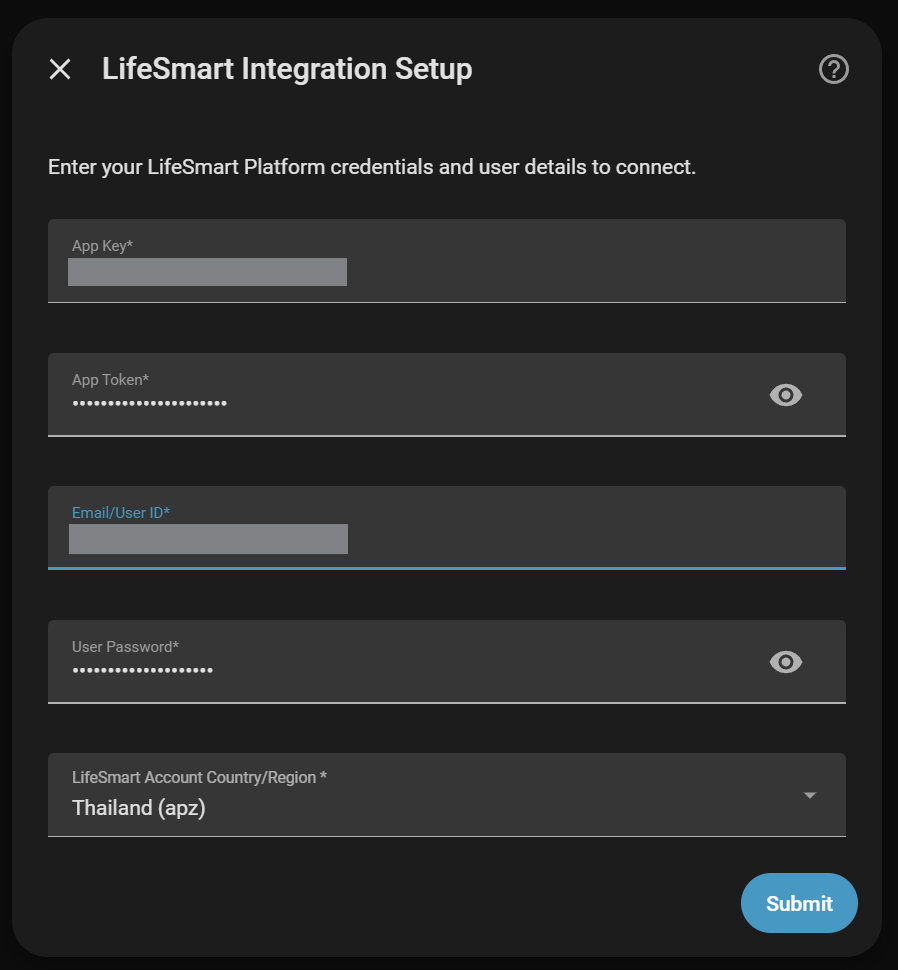
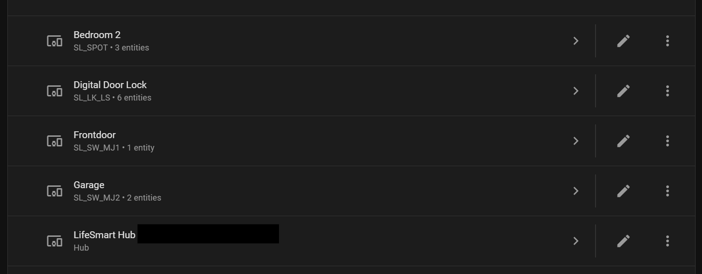
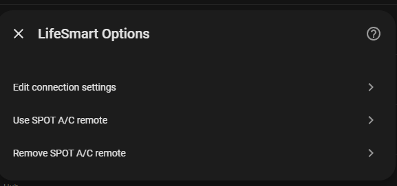
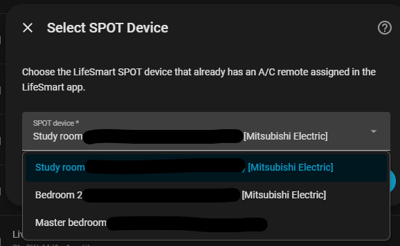
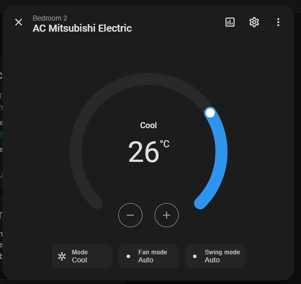
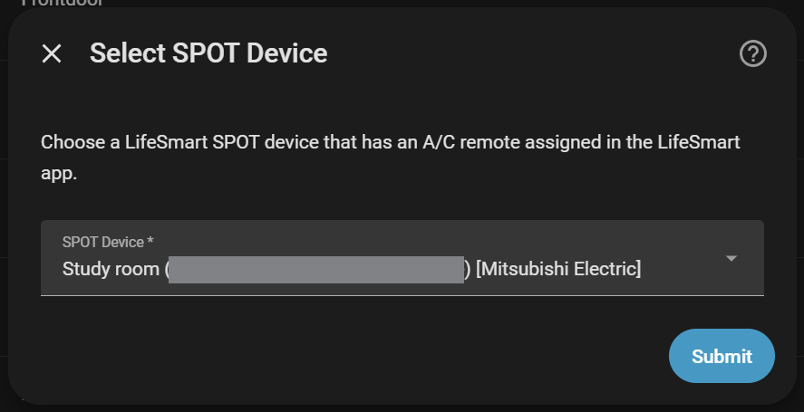
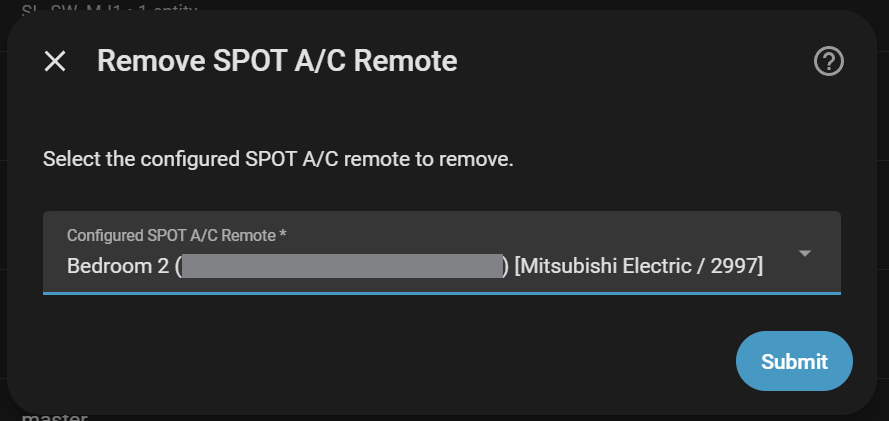

# LifeSmart for Home Assistant

Cloud-based Home Assistant integration for LifeSmart devices. The integration discovers your LifeSmart devices through the LifeSmart Open Platform API, creates Home Assistant entities, and receives ongoing updates through the LifeSmart WebSocket service.

There is no direct local communication between Home Assistant and the LifeSmart hub at the moment, so internet access and valid LifeSmart cloud credentials are required.

## Prerequisites

1. Confirm your LifeSmart account email/user ID and country/region in the LifeSmart mobile app account/profile screen. See the screenshot below.
1. Create an application in the [LifeSmart Open Platform](https://www.ilifesmart.com/open/login) to obtain an `app key` and `app token`.
1. Use the same LifeSmart account that you use in the mobile app. You will enter its email/user ID and password during Home Assistant setup.

The LifeSmart Open Platform page may open in Chinese; use the language menu in the top-right corner if needed.

Important: LifeSmart Open Platform applications usually do not return door lock devices by default. Contact LifeSmart and ask them to enable lock device access for your application if you need lock support.

## Installation

### HACS

OR

1. Open Home Assistant.
1. Go to `HACS` -> `Integrations`.
1. Click `Explore & Download Repositories`.
1. Search for `LifeSmart`.
1. Select the LifeSmart integration and click `Download`.
1. Restart Home Assistant when HACS asks you to.

Installing from HACS lets Home Assistant notify you when a new version is available.

### Manual

Use manual installation only if you cannot use HACS.

1. Copy the `custom_components/lifesmart` directory to `config/custom_components/` in Home Assistant.
1. Restart Home Assistant.

## Setup

1. Go to `Settings` → `Devices & Services`.
1. Click `Add Integration`.
1. Search for `LifeSmart` and select it.
1. Enter your LifeSmart Platform credentials:
   - **App Key**: From your LifeSmart Open Platform application
   - **App Token**: From your LifeSmart Open Platform application  
   - **Email/User ID**: Your LifeSmart account email address or user ID (see below)
   - **User Password**: Your LifeSmart account password
   - **LifeSmart Account Country/Region**: Select the country or region shown in the LifeSmart mobile app account/profile screen (see below)
1. Click `Submit` and wait for device discovery.

The integration will automatically discover and create entities for all your LifeSmart devices.

## User Interface Improvements

The LifeSmart integration features a modern, user-friendly interface with:

- **Clear Field Labels**: Descriptive names like "LifeSmart Account Country/Region" instead of generic "region"
- **Helpful Descriptions**: Context for each configuration step
- **Consistent Terminology**: Standardized "ID" capitalization and professional formatting
- **Guided Setup**: Step-by-step A/C configuration with clear instructions

All text has been optimized for clarity and ease of use.

### Finding Your LifeSmart Email/User ID And Country/Region

Your email/user ID and account country/region are available in the LifeSmart mobile app account/profile area.

## Supported Devices

Support is based on the attributes returned by the LifeSmart API. Some models create more than one Home Assistant entity.

| Family | Models | Entities / support | Notes |
| ------ | ------ | ------------------ | ----- |
| Switches and relay outputs | `OD_WE_OT1`, `SL_MC_ND1`, `SL_MC_ND2`, `SL_MC_ND3`, `SL_OL`, `SL_OL_3C`, `SL_OL_DE`, `SL_OL_UK`, `SL_OL_UL`, `SL_OL_W`, `SL_P_SW`, `SL_S`, `SL_SF_IF1`, `SL_SF_IF2`, `SL_SF_IF3`, `SL_SF_RC`, `SL_SPWM`, `SL_SW_CP1`, `SL_SW_CP2`, `SL_SW_CP3`, `SL_SW_DM1`, `SL_SW_FE1`, `SL_SW_FE2`, `SL_SW_IF1`, `SL_SW_IF2`, `SL_SW_IF3`, `SL_SW_MJ1`, `SL_SW_MJ2`, `SL_SW_MJ3`, `SL_SW_ND1`, `SL_SW_ND2`, `SL_SW_ND3`, `SL_SW_NS1`, `SL_SW_NS2`, `SL_SW_NS3`, `SL_SW_RC`, `SL_SW_RC1`, `SL_SW_RC2`, `SL_SW_RC3`, `V_IND_S` | Switch entities for supported `L1-L3` / `P1-P3` outputs | `SL_SW_MJ1` and `SL_SW_MJ2` have been tested with real devices. |
| Lights | `SL_OL_W`, `SL_SW_IF1`, `SL_SW_IF2`, `SL_SW_IF3`, `SL_CT_RGBW`, `SL_LI_WW` | RGB/RGBW, brightness, and dimmer entities where attributes are reported | Light support depends on the device exposing the expected light attributes. |
| Smart plug | `SL_OE_DE` | Switch, energy, and power sensors | Tested with real devices. |
| Generic controllers | `SL_P`, `SL_JEMA` | `P2-P4` switch outputs, `P5-P7` binary inputs, `P1` diagnostic configuration sensor | `P1` is disabled by default because it exposes configuration bits. `SL_JEMA` also supports independent HA switch outputs `P8-P10`. |
| Covers and garage doors | `SL_DOOYA`, `SL_DOOYA_V2`, `SL_DOOYA_V3`, `SL_DOOYA_V4`, `SL_SW_WIN`, `SL_CN_IF`, `SL_CN_FE`, `SL_P_V2`, `SL_ETDOOR` | Cover entities | Position support is available on DOOYA variants. Other controllers generally support open/close/stop. See [CURTAIN_SUPPORT.md](./CURTAIN_SUPPORT.md). |
| Door locks | `SL_LK_LS`, `SL_LK_GTM`, `SL_LK_AG`, `SL_LK_SG`, `SL_LK_YL`, `SL_LK_TY`, `SL_LK_DJ` | Battery sensor, lock/alarm binary sensors, doorbell where reported, operation/history details where reported | `SL_LK_LS` has been tested with real devices. Supported attributes vary by lock model. |
| Motion and presence sensors | `SL_SC_MHW`, `SL_SC_BM`, `SL_SC_CM`, `SL_P_RM`, `SL_DF_MM` | Motion binary sensors; battery/temperature where reported | `SL_SC_CM` and `SL_P_RM` use model-specific attribute keys. |
| Door, guard, and vibration sensors | `SL_SC_G`, `SL_SC_BG`, `SL_DF_GG` | Door/opening, button/occupancy, vibration/tamper, battery, temperature where reported | `SL_SC_BG` supports `G`, `V`, `B`, and `AXS`. |
| Safety sensors | `SL_P_A`, `SL_SC_WA`, `SL_SC_CH`, `SL_SC_CP`, `SL_DF_SR`, `SL_ALM` | Smoke, water leak, gas, siren/alarm binary sensors; battery/sensor values where reported | Gas/noise/alarm devices expose both measurement and alarm attributes when available. |
| Environmental sensors | `SL_SC_THL`, `SL_SC_BE`, `SL_SC_CQ`, `SL_SC_CA`, `SL_SC_CN` | Temperature, humidity, illuminance, battery, CO2, TVOC, noise, USB/voltage where reported | Attribute coverage follows the LifeSmart device attribute list. |
| Electricity meters | `ELIQ_EM`, `V_DLT_645_P`, `V_DLT645_P` | Power and/or energy sensors | DLT values are decoded from LifeSmart float values when needed. |
| 485 controller | `V_485_P` | Relay outputs plus Modbus-style sensors for power, energy, voltage, current, frequency, temperature, humidity, PM, gas, CO2, TVOC, sound, and smoke keys | Supports documented base keys and numbered variants such as `EE1`, `EP2`, `PM10`. |
| Air purifier | `OD_MFRESH_M8088` | Switch plus mode, temperature, humidity, PM2.5, filter life, and UV sensors | Mode sensor is an enum. |
| Nature series | `SL_NATURE` | Switch-board variants create `P1-P3` switches; thermostat variants create a climate entity; `P4` temperature is exposed when reported | Variant is detected from the reported attributes. |
| Native A/C panels | `V_AIR_P`, `V_SZJSXR_P`, `V_T8600_P`, `SL_CP_DN` | Climate entities | These use LifeSmart native `EpSet` control, not SPOT IR profiles. |
| SPOT and IR remotes | `SL_SPOT`, `MSL_IRCTL`, `OD_WE_IRCTL`, `SL_P_IR`, `SL_P_IR_V2` | Remote entities for IR command storage/sending; optional A/C climate entities; light entities only on SPOT models with light attributes | `SL_P_IR` and `SL_P_IR_V2` do not create light entities. `SL_P_IR_V2` exposes pairing-button `P2` as a binary sensor when reported. |

## Screenshots

### Configuration Interface

The integration features a clean, user-friendly configuration interface with clear field labels and helpful descriptions:

### Device Examples

### SPOT A/C Setup

Easy step-by-step A/C remote configuration:

- Uses LifeSmart cloud IR profiles for reliable A/C control
- Restores last Home Assistant state after reloads
- Supports power on/off, mode selection, temperature, and fan speed
- Does not show current room temperature (SPOT devices lack built-in sensors)

For detailed SPOT device information, see [SPOT_SUPPORT.md](./SPOT_SUPPORT.md)..

## Native A/C Control Panels

Native LifeSmart A/C control panels are discovered automatically as climate entities.

| Model  | Remark |
| ------ | ------ |
| V_AIR_P | Central air board |
| V_SZJSXR_P | Uses the V_AIR_P attribute specification |
| V_T8600_P | Uses the V_AIR_P attribute specification |
| SL_CP_DN | Thermostat |

Supported controls:
- Power on/off
- HVAC mode: Auto, Fan, Cool, Heat, Dry
- Target temperature
- Current temperature
- Fan speed: Low, Medium, High

These devices use the LifeSmart `EpSet` API directly, rather than SPOT IR profiles.

## Credits

This project combines and builds on work from:

- https://github.com/skyzhishui/custom_components by @skyzhishui
- https://github.com/Blankdlh/hass-lifesmart by @Blankdlh
- https://github.com/likso/hass-lifesmart by @likso

## License

This project is licensed under the MIT License - see the [LICENSE](LICENSE) file for details.

